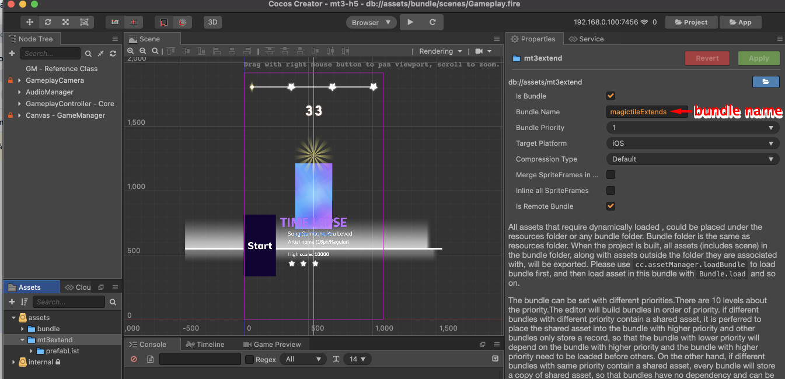

# MEPIntant
> Amanotes's mep_instant SDK DOC

---------------------------------------------------------

# MEPIntant SDK

| Version | Changelog | Doc | Link | Cocos extension |
| ----------- | ----------- | ----------- | ----------- | ----------- | 
| 2.5.0 | <ul><li>Fix current time precision </li><li>Save game support</li></ul> | [Doc](docs_2_5_0/DOCS.md) | [UNPKG](https://unpkg.com/@mep.tech/instant@2.5.0/dist/mepinstant.umd.production.min.js) | [ZIP](https://d1wkdokb986dq4.cloudfront.net/mep-instant-sdk/cocos_extension/mep_instant_2.3.0-alpha8.zip)
| 2.5.1 | <ul><li>autoSpecificContent flag added </li> | [Doc](docs_2_5_1/DOCS.md) | [UNPKG](https://unpkg.com/@mep.tech/instant@2.5.1/dist/mepinstant.umd.production.min.js) | [ZIP](https://d1wkdokb986dq4.cloudfront.net/mep-instant-sdk/cocos_extension/mep_instant_2.3.0-alpha8.zip)
| 2.5.2 | <ul><li> specificContent flag added </li> | [Doc](docs_2_5_2/DOCS.md) | [UNPKG](https://unpkg.com/@mep.tech/instant@2.5.2/dist/mepinstant.umd.production.min.js) | [ZIP](https://d1wkdokb986dq4.cloudfront.net/mep-instant-sdk/cocos_extension/mep_instant_2.3.0-alpha8.zip)
| 2.6.0 | <ul><li> getSpecificContent function added </li> | [Doc](docs_2_6_0/DOCS.md) | [UNPKG](https://unpkg.com/@mep.tech/instant@2.6.0/dist/mepinstant.umd.production.min.js) | [ZIP](https://d1wkdokb986dq4.cloudfront.net/mep-instant-sdk/cocos_extension/mep_instant_2.6.0.zip)
| 2.7.0 | <ul><li> Add platform hide loading screen function </li> | [Doc](docs_2_7_0/DOCS.md) | [UNPKG](https://unpkg.com/@mep.tech/instant@2.7.0/dist/mepinstant.umd.production.min.js) | [ZIP](https://d1wkdokb986dq4.cloudfront.net/mep-instant-sdk/cocos_extension/mep_instant_2.7.0.zip)
| 2.8.2 | <ul><li> feature mepconnect-multibundle </li><li> new mepconnect-specific API </li><li> remove cocos2d local save API for platform safety </li></ul> | [Doc](docs_2_8_2/DOCS.md) | [UNPKG](https://unpkg.com/@mep.tech/instant@2.8.2/dist/mepinstant.umd.production.min.js) | [ZIP](https://d1wkdokb986dq4.cloudfront.net/mep-instant-sdk/cocos_extension/mep_instant_2.8.2.zip)

*MULTIBUNDLE IS IN TESTING*

# How to enable Native-like game

## Prerequisite
- Cocos Creator version 2.4.4
- Programming language: Typescript.
- mep_instant’s cocos extension: 
  - [Cocos's guideline](https://docs.cocos.com/creator/manual/en/extension/install-and-share.html#project-packages)
  - [mep_instant cocos creator](#mepintant-sdk)
- Game bundling: [cocos’s guideline](https://docs.cocos.com/creator/manual/en/scripting/asset-bundle.html)
- SandboxApp testflight version 2.0.0 - 202104081641
- Bundle size limit: 5MB

## Unsupported
- cookie
- DOM
- NodeJS 

## Sample steps to test with SandBox app
> [Sample template](./resources/mep-instant-samplegame-native.zip) <br>
> Sample Game: Magic Tiles 3 <br>
> Sample Game ID: mt3

- install [mep_instant’s cocos extension](#prerequisite) in project <br>

- Bundling project

- Export bundle <br>

- <b>Testing: </b>
  1. rename
  - Native games: the game bundle should be renamed to "url" <br>
  - H5 games: the exported folder should be renamed to "url" <br>
  2. Zip "url" folder
  3. Host "url.zip" file on CDN and start testing with iOS Sandbox on testflight
  - Note: Game will no longer be tested on GameOfSongs QC environment but a different Sandbox app. please contact MEPTeam if you dont have access to the tool.


- [Debug with google chrome devtools](https://docs.cocos.com/creator/manual/en/publish/debug-jsb.html)
  - NOTE: only works on google Chrome devtools.
  - NOTE: In case of JS exception, devtools will failed to connect as well. 

## Multi-bundle
  Please refer to this [file](./resources/MEPCONNECT_MULTIBUNDLE.pdf) on how to configurate Multi-bundle
  
## Samples
### Read and filter note

```javascript
const difficultyToOctave = {
  "SupperEasy": 4,
  "Easy": 5,
  "Medium": 6,
  "Hard": 7,
  "Expert": 9
}
function midiToNoteName(midi) {
  let notes = ["C", "C#", "D", "D#", "E", "F",
    "F#", "G", "G#", "A", "A#", "B"];
  let noteIdx = midi % 12;
  let output = {
    line: noteIdx + 1,
    noteName: notes[noteIdx],
    octave: ((midi - noteIdx) / 12) - 1
  }
  return output
}
MEPInstant.initializeAsync().then(() => {
  let binURL = 'https://music.amanotes.net/media/c01a912b-46cc-4354-9e38-ffe63d9dd503/97360c7d-979b-4c60-92d1-787cf6c6d82e.bin'
  //'https://music.amanotes.net/media/ef661fc1-395a-46c9-b87d-901add67d4ea/6dcc59f4-feb1-465f-8154-f464f90b935b.bin'
  MEPInstant.getNotesAsync(binURL)
    .then(levelData => {
      console.log(levelData)
      const notes = levelData.fullNotes;
      let notesFiltered = notes.filter(note => midiToNoteName(note.midi).octave == difficultyToOctave["Medium"])
      console.log(notesFiltered.length)
      console.log(JSON.stringify(notesFiltered))
    })
})
```

### How to load specific content

 ```javascript
interface SpecificContent {
  contentUrl: string, //url file 
  header: string,     //csv_url, sfx_count, zip_url
  fileType: string    //CSV,SFX,ZIP
}
MEPInstant.initializeAsync().then(() => {
  MEPInstant.startGameAsync().then(gameData => {
    console.log(JSON.stringify(gameData.specificContent)); //array specific content 
    
    //TODO process auto specific content
    for (let j = 0; j < gameData.specificContent.length; j++) {
      if (gameData.specificContent[j].fileType === "CSV") {
        let contentURl = gameData.specificContent[j].contentUrl;
        //TODO process file CSV reference from docs:
        cc.assetManager.loadRemote(contentURL, (err, data: any) => {
          if (data) {
              var csvContentString = data._$nativeAsset;
              //CSV parsing
              console.log("Done generating csv content file")
          } else {
              console.log(`Failed parse data from csv. More details: ${err}`)
          }
        });
      }
    }
  })
})
```

### How to load bundle
 
 ```javascript
let bundleName = 'magictileExtends'
cc.assetManager.loadBundle(bundleName, (err:Error, bundle: cc.AssetManager.Bundle) => { 
  
  //TODO process error
  if(err) {
    console.error(err.stack)
    return;
  }

  // load the prefab (${project}/assets/mt3extend/prefabList/star) from prefabList folder
  bundle.load('prefabList/star', cc.Prefab, (err:Error, prefab) => {
    //TODO process error
    if(err) {
      console.error(err.stack)
      return;
    }

    //TODO process prefab 
    let node = cc.instantiate(prefab);
  });
}
```